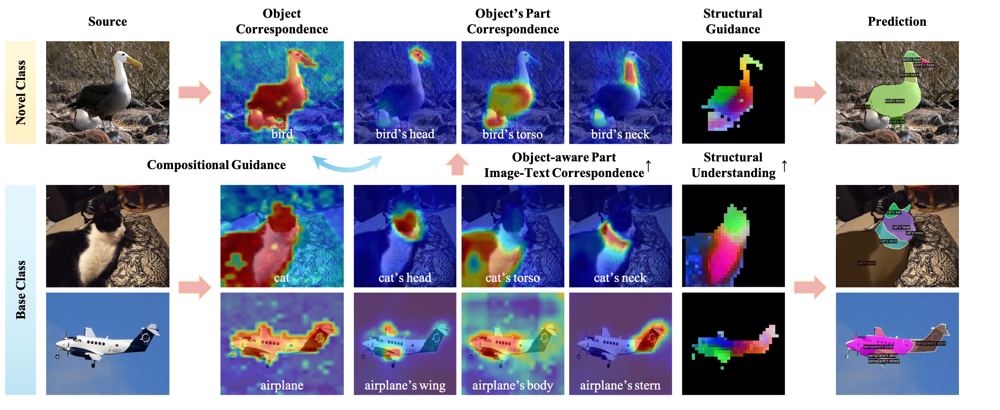
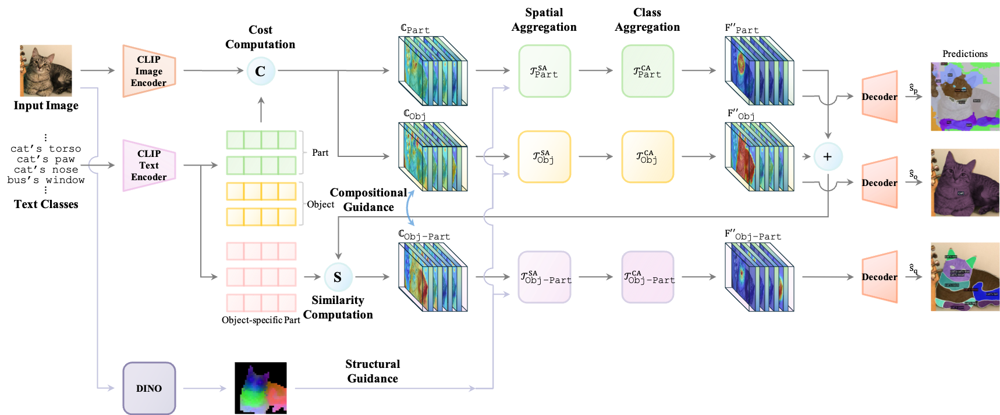

<h2 align="center">
    Fine-Grained Image-Text Correspondence with<br/>
    Cost Aggregation for Open-Vocabulary Part Segmentation
</h2>
<h5 align="center">
    Jiho Choi<sup>1 *</sup>, Seonho Lee<sup>1 *</sup>, Seungho Lee<sup>2</sup>, Minhyun Lee<sup>2</sup>, Hyunjung Shim<sup>1</sup><br>
    (* indicates equal contributions)<br>
    <sup>1</sup>Graduate School of Artificial Intelligence, KAIST, Republic of Korea<br>
    <sup>2</sup>School of Integrated Technology, Yonsei University, Republic of Korea<br>
    <code>{jihochoi, glanceyes, kateshim}@kaist.ac.kr</code>, <code>{seungholee, lmh315}@yonsei.ac.kr</code><br>
</h5>

<h4 align="center">

[](https://arxiv.org/abs/2501.09688)
[](https://cvpr.thecvf.com/virtual/2025/poster/32627)

</h4>

<div align="center">
    <!--  -->
    
    <!--  -->
</div>


</h4>

---


<br/>

### PartCATSeg

PartCATSeg is a novel framework to address the critical challenges of OVPS(Open-Vocabulary Part Segmentation) and significantly improve model performance by leveraging the cost volume.

<div align="center">
    
</div>

<br/>

### Updates

- [x] [2025.04.15] 👨‍💻 The official codes have been released!
- [x] [2025.02.26] 🎉 Our paper has been accepted to [CVPR 2025](https://cvpr.thecvf.com/Conferences/2025)!
- [x] [2025.01.16] 📄 Our paper is now available! You can find the paper [here](https://arxiv.org/abs/2501.09688).


<br/>

### Installation

<!-- TODO: INSTALL.md -->

```sh
# ------------------
#     Init conda
# ------------------
conda create --name partcatseg python=3.8 -y
conda activate partcatseg
pip install --upgrade pip
conda install cuda=12.4.1 -c nvidia -y
pip install torch==2.2.2 torchvision==0.17.2 --index-url https://download.pytorch.org/whl/cu121
pip install timm==0.9.1
pip install scikit-image==0.21.0
pip install scikit-learn==0.24.2
pip install opencv-python==4.5.5.64
pip install hydra-core==1.3.2
pip install openmim==0.3.6
pip install mmsegmentation==0.29.1
pip install tokenizers==0.11.1
pip install Pillow~=9.5
pip install numpy==1.23.0
pip install einops ftfy regex fire ninja psutil gdown

# --------------------------
#     Install Detectron2
# --------------------------
pip install 'git+https://github.com/facebookresearch/detectron2.git'
python -c "import detectron2; print(detectron2.__version__)"  # 0.6

# --------------------------
#     Install mmcv
# --------------------------
# pip install mmcv-full==1.7.1
# => if an error occurs
pip install mmcv-full==1.7.1 -f https://download.openmmlab.com/mmcv/dist/cu110/torch1.7.0/index.html
python -c "import mmcv; print(mmcv.__version__)"  # 1.7.1
```
<br/>

### Prepare Datasets

```sh
cd datasets
```

#### PascalPart116

* You can find further information in the [OV-PARTS](https://github.com/OpenRobotLab/OV_PARTS) GitHub repository.

```sh
gdown https://drive.google.com/uc?id=1QF0BglrcC0teKqx15vP8qJNakGgCWaEH
tar -xzf PascalPart116.tar.gz
find ./PascalPart116/images/val/ -name '._*' -delete
find ./PascalPart116/ -name '._*' -delete
```


#### ADE20KPart234

```sh
gdown https://drive.google.com/uc?id=1EBVPW_tqzBOQ_DC6yLcouyxR7WrctRKi
tar -xzf ADE20KPart234.tar.gz
```

#### PartImageNet (Seg)

* Download the `LOC_synset_mapping.txt` file from [this link](https://www.kaggle.com/c/imagenet-object-localization-challenge/data) and place it in the `datasets` folder.
* Download `PartImageNet_Seg` from [PartImageNet](https://github.com/TACJu/PartImageNet) and extract it into the `datasets` folder.

#### PartImageNet (OOD)

* **<i>TBA</i>**

<br/>

### Preprocess Datasets

- PascalPart116
- ADE20KPart234
- PartImageNet (Seg)
- PartImageNet (OOD) - **<i>TBA</i>**

```sh
# PascalPart116
python baselines/data/datasets/mask_cls_collect.py \
    datasets/PascalPart116/annotations_detectron2_part/val \
    datasets/PascalPart116/annotations_detectron2_part/val_part_label_count.json

python baselines/data/datasets/mask_cls_collect.py \
    datasets/PascalPart116/annotations_detectron2_obj/val \
    datasets/PascalPart116/annotations_detectron2_part/val_obj_label_count.json

# ADE20KPart234
# (no preprocessing required)

# PartImageNet (Seg)
cd datasets
python partimagenet_preprocess.py --data_dir PartImageNet
# Make sure to have LOC_synset_mapping.txt in the datasets folder mentioned above.

# PartImageNet (OOD)
# TBA
```

<br/>

### Pre-trained Weights

Please first donwload the pre-trained CAT-Seg weight `model_final_base.pth` from the following link to use them in the training.

<table><tbody>
<!-- START TABLE -->
<!-- TABLE HEADER -->
<th valign="bottom">Model</th>
<th valign="bottom">Checkpoint</th>
<tr>
<!-- TABLE BODY -->
<td align="center">CAT-Seg</td>

<td align="center"><a href="https://huggingface.co/hamacojr/CAT-Seg/blob/main/model_final_base.pth">download link</a></td>

</tr>
</tbody></table>


Make sure to place the downloaded weights in the `pretrain_weights` folder.

```bash
mkdir pretrain_weights && cd pretrain_weights
# CAT-Seg
wget https://huggingface.co/hamacojr/CAT-Seg/resolve/main/model_final_base.pth
cd ..
```

<br/>

For the evaluation, we provide the pre-trained weights for the PartCATSeg model on the following datasets:

<table><tbody>
<!-- START TABLE -->
<!-- TABLE HEADER -->
<th valign="bottom">Model</th>
<th valign="bottom">Setting</th>
<th valign="bottom">Dataset</th>
<th valign="bottom">Checkpoint</th>
<!-- TABLE BODY -->
<!-- ROW: per_pixel_baseline_R50_bs16_160k -->
<tr>
    <td align="center">PartCATSeg</td>
    <td align="center">zero-shot</td>
    <td align="center">Pascal-Part-116</td>
    <td align="center"><a href="https://drive.google.com/file/d/1JUJjJQLMKE96H5SLNs4EMm4jiU6fPgRb/view?usp=share_link">model</a></td>
</tr>
<tr>
    <td align="center">PartCATSeg</td>
    <td align="center">zero-shot</td>
    <td align="center">ADE20K-Part-234</td>
    <!-- <td align="center"><i>TBA</i></td> -->
    <td align="center"><a href="https://drive.google.com/file/d/1MKQEk71o9Xvs4aBY_GLyGa1lWTaW10fv/view?usp=share_link">model</a></td>
</tr>
<tr>
    <td align="center">PartCATSeg</td>
    <td align="center">zero-shot</td>
    <td align="center">PartImageNet (Seg)</td>
    <td align="center"><i>TBA</i></td>
    <!-- <td align="center"><a href="https://drive.google.com/file/d/1zvV6achGzDS_tAwulaSkFYblMTghMHO6/view?usp=share_link">model</a></td> -->
</tr>
<!-- <tr>
    <td align="center">PartCATSeg</td>
    <td align="center">zero-shot</td>
    <td align="center">PartImageNet (OOD)</td>
    <td align="center"><i>TBA</i></td>
    <td align="center"><a href="https://drive.google.com/file/d/1XqgHI4CRcfLIz2j8_ZbIvoF_GFjMqCqn/view?usp=drive_link">model</a></td>
</tr> -->

</tbody></table>

```sh
mkdir weights && cd weights

# Pascal-Part-116
# PartCATSeg (partcatseg_voc.pth (928M on Ubuntu / 885M on Google Drive))
gdown https://drive.google.com/uc?id=1JUJjJQLMKE96H5SLNs4EMm4jiU6fPgRb

# ADE20K-Part-234
# PartCATSeg (partcatseg_ade.pth (928M on Ubuntu / 885M on Google Drive))
gdown https://drive.google.com/uc?id=1MKQEk71o9Xvs4aBY_GLyGa1lWTaW10fv

# PartImageNet (Seg)
# PartCATSeg (partcatseg_partimagenet_seg.pth)
# TBA
```

<br/>

### Usage (Run)

##### Zero-Shot Prediction

```sh
# -------------
#     Train
# -------------
python train_net.py \
    --num-gpus 4 \
    --config-file configs/zero_shot/partcatseg_voc.yaml

# -----------------
#     Inference
# -----------------
python train_net.py \
    --num-gpus 4 \
    --config-file configs/zero_shot/partcatseg_voc.yaml \
    --eval-only MODEL.WEIGHTS ./weights/partcatseg_voc.pth
```

<br/>

### Project Structure

<!--

##### Important Files

```sh
configs/zero_shot/partcatseg_voc.yaml
baselines/partcatseg.py
baselines/evaluation/partcatseg_evaluation.py
baselines/data/datasets/register_pascal_part_116.py
baselines/modeling/backbone/dinov2_backbone.py
baselines/modeling/heads/part_cat_seg_head.py
baselines/modeling/transformer/part_cat_seg_model.py
baselines/modeling/transformer/part_cat_seg_predictor.py
```

-->


```markdown
[PROJECT_ROOT]
├── datasets/
│   ├── PascalPart116/
│   │   ├── images
│   │   ├── annotations_detectron2_obj
│   │   └── annotations_detectron2_part
│   ├── ADE20KPart234/
│   └── PartImageNet/
├── weights/
│   ├── partcatseg_voc.pth
│   └── partcatseg_ade.pth
├── configs/
│   ├── zero_shot
│   │   ├── partcatseg_voc.yaml
│   │   ├── partcatseg_ade.yaml
│   │   ├── partcatseg_partimagenet.yaml
│   │   └── ...
├── baselines/
│   ├── evaluation/
│   │   └── partcatseg_evaluation.py
│   ├── data/
│   │   ├── dataset_mappers/
│   │   │   └── object_part_mapper.py
│   │   └── datasets/
│   │       └── register_pascal_part_116.py
│   ├── modeling/
│   │   ├── backbone/
│   │   │   └── dinov2_backbone.py
│   │   ├── heads/
│   │   │   └── part_cat_seg_head.py
│   │   └── transformer/
│   │       ├── part_cat_seg_model.py
│   │       ├── part_cat_seg_predictor.py
│   │       └── part_cat_seg_model.py
│   ├── utils/
│   │   └── visualizer.py
│   ├── third_party/
│   ├── partcatseg.py
│   └── config.py
├── README.md
└── train_net.py
```

<br/>

### Acknowledgement

We would like to express our gratitude to the open-source projects and their contributors, including [PartCLIPSeg](https://github.com/kaist-cvml/part-clipseg), [OV-PARTS](https://github.com/OpenRobotLab/OV_PARTS), [CLIPSeg](https://github.com/timojl/clipseg), [Mask2Former](https://github.com/facebookresearch/Mask2Former), [CLIP](https://github.com/openai/CLIP), and [OV-DETR](https://github.com/yuhangzang/OV-DETR).

<!-- [ViT](https://github.com/google-research/vision_transformer)
[Swin](https://github.com/microsoft/Swin-Transformer) -->


<!-- ### Issues

##### `torch.nn.parallel.DistributedDataParallel`

```
# vim ~/miniconda3/envs/partcatseg/lib/python3.8/site-packages/detectron2/engine/defaults.py
# Line 74
(AS IS) `ddp = DistributedDataParallel(model, **kwargs)`
(TOBE) `ddp = DistributedDataParallel(model, **kwargs, find_unused_parameters=True)`
```

> RuntimeError: Expected to have finished reduction in the prior iteration before starting a new one. This error indicates that your module has parameters that were not used in producing loss. You can enable unused parameter detection by passing the keyword argument `find_unused_parameters=True` to `torch.nn.parallel.DistributedDataParallel`, and by making sure all `forward` function outputs participate in calculating loss.

-->